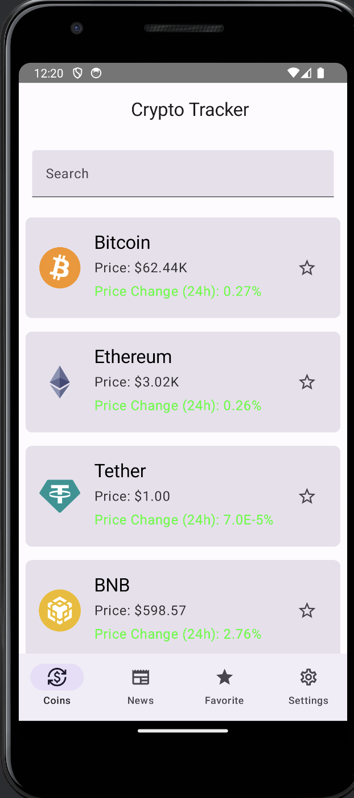
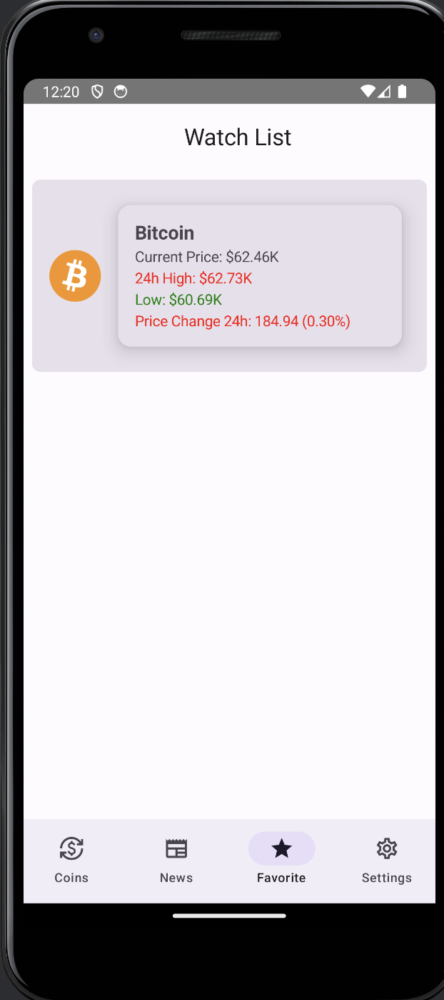
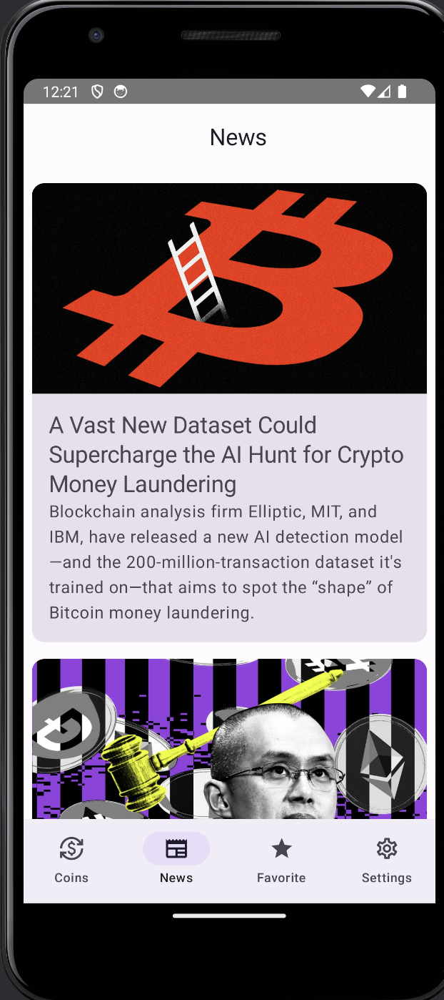
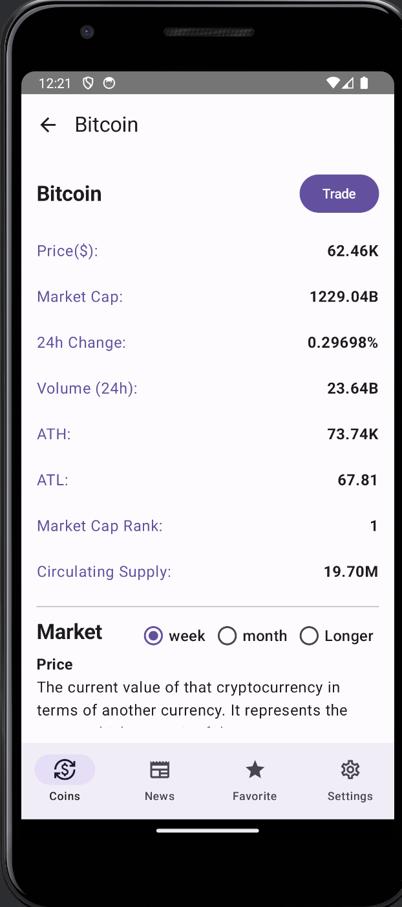
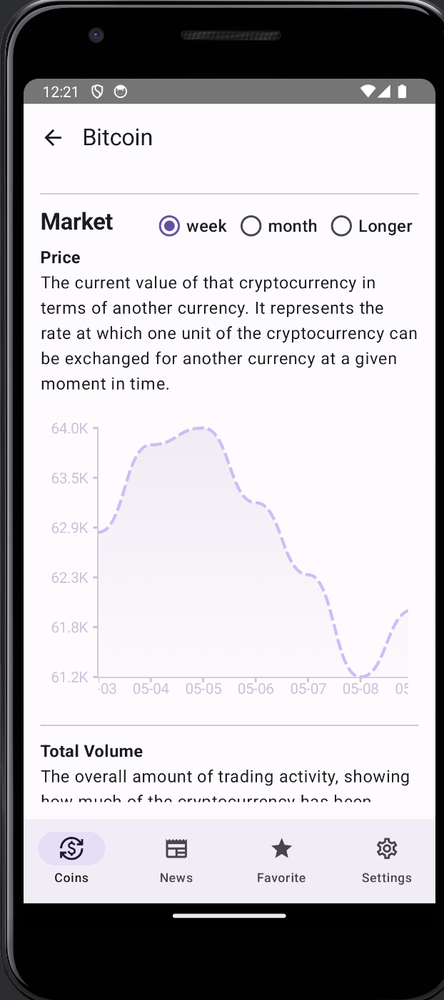
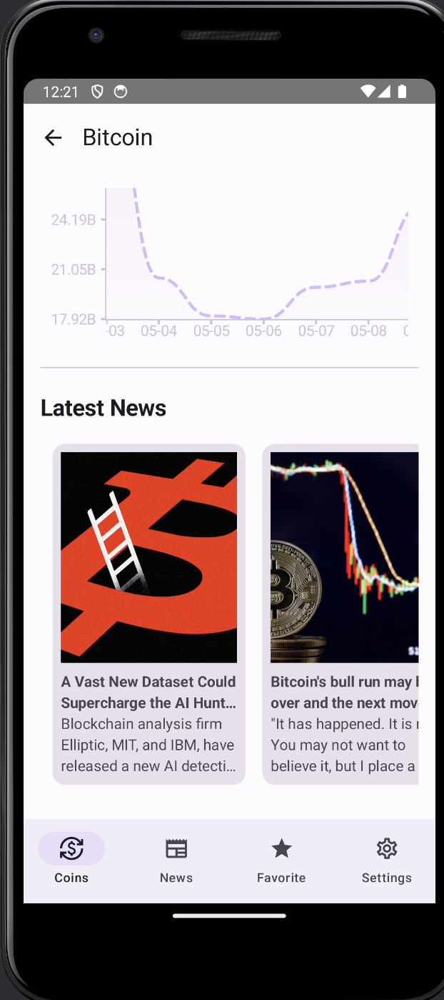

# CodeCompany Crypto Tracker
Version 1.0.0

Release Date: May 9, 2024 

# CodeCompany Developer
- Shuaiqi Huang
- Yuyan Li
- Zhangde Song

# Motivation
In today's dynamic cryptocurrency market, rapid price fluctuations present both opportunities and risks. However, individuals often find it challenging to monitor market movements continuously amidst daily activities such as travel, meals, and social engagements. Thankfully, modern technology empowers individuals to carry the functionality of a computer in their pockets through mobile phones.

In response to this need, we are developing Crypto Tracker, an app designed to provide real-time market data for every cryptocurrency along with relevant market news. By leveraging this app, users can actively engage with the crypto market at any time, whether they are investors, active traders, or simply curious about crypto trends.

Our initial concept evolved into a comprehensive app that:

- Tracks cryptocurrencies, capturing essential information such as price, volume, market cap, 24-hour price change, and daily high/low.
- Aggregates news articles related to the crypto market, offering users insights into current trends and developments.
- Incorporates a notification system to alert users when a certain price threshold is reached, enabling timely decision-making.
- Features a user-friendly search bar, eliminating the need for manual scrolling through extensive lists of cryptocurrencies.
- Provides a dedicated watchlist where users can monitor their preferred currencies, facilitating personalized market tracking.
- Includes a settings page for user feedback and communication with developers, ensuring continuous improvement and user engagement.

By offering a seamless experience for accessing real-time market data and news, Crypto Tracker empowers users to stay informed and engaged with the crypto market, anytime and anywhere.

# Main Features

## Market View

  
  

- List of cryptocurrencies and their basic information (price change, current price).
- Each cryptocurrency item has a star icon to add it to the watchlist.
- Fixed position search bar for easy coin search.
  
## Watchlist

- Displays cryptocurrencies starred from the market view.
- Shake device to randomly add popular cryptocurrencies if watchlist is empty.
- Clicking on a cryptocurrency directs user to its detail page.
- Swipe left or right to remove cryptocurrency from the watchlist.

## News List

- A list of news relevant to the cryptocurrency market.
- Clicking on news directs user to a webpage with more details.

## Detail Page

  
  
  

- Contains detailed information and charts for a cryptocurrency.
- Users can modify the chart duration to display data for 7, 30, or 90 days.
- Basic information about the cryptocurrency and a trade button directing users to Binance.
- Price and volume charts for the selected duration.
- Latest news related to the cryptocurrency, clickable to view more details.

# Architecture
### Common Folder
The **Common** folder contains the `navigation` file, which is crucial for handling events triggered by clicking the navigation bar at the bottom of the app. This file ensures seamless navigation, directing users to the appropriate pages within the application.
### Data Folder
#### local
Within the **Data** folder, the **local** subfolder hosts the `developer` file. This file includes a class responsible for managing developer information displayed in the "Settings" page of the app. Users can access details about the developers behind the app's creation through this feature.
#### model
The **model** subfolder in the **Data** directory encompasses multiple classes defining structures of information fetched from API calls. These models play a pivotal role in displaying data on both the main and detail pages of the application.

### ViewModels
ViewModels, including `CoinTickerViewModel`, `CoinDataViewModel`, and `CoinNewsViewModel`, serve as intermediaries between the Views (UI components) and the Model (data layer). Leveraging Kotlin's coroutines and Flow, these ViewModels efficiently manage asynchronous data streams, ensuring a responsive and dynamic user interface.

### Network Folder
The **Network** folder houses Retrofit interfaces, such as `CoinRepos`, which facilitate seamless communication with cryptocurrency APIs to fetch data. By abstracting the complexity of network communication and data retrieval, this layer provides a clean API for ViewModels to interact with, enhancing overall code maintainability and readability.

### Presentation Folder
The **Presentation** folder comprises files responsible for user interaction, initializing pages/fragments, and designing the user interface using Jetpack Compose. From handling user actions like touching, swiping, and shaking the device to initializing various pages such as the crypto currency list, news list, watchlist, settings, and crypto currency detail, this folder plays a pivotal role in shaping the user experience of the application.

### ui.theme Folder
The **ui.theme** folder is dedicated to setting the color scheme for the app, ensuring a visually cohesive and aesthetically pleasing user interface across different screens and components.

## Technologies / Dependencies

- Java
- Android SDK
- AndroidX
- Preview: Android WebView
- Data Plotting: Ychart
- Build system: Gradle

## External Resources

- Cryptocurrency API: [https://api.coingecko.com/api/v3/](https://api.coingecko.com/api/v3/)
- News API: [https://newsapi.org/](https://newsapi.org/)

## Privacy

Crypto Tracker will not use your local data or request your personal information. No personal data is shared with the author or any third parties. The app does not involve any trading recommendation mechanism nor any trade involving real currency. Files are stored locally in a user-selectable folder, defaulting to the internal storage "Documents" directory.

## Android Permissions

- INTERNET
- ACCELEROMETER SENSOR
- WRITE & READ FROM LOCAL FILE

## Important Functionality

### Plotting Data
In **AssetDetail.kt** located in the presentation folder, we've incorporated a feature to visualize historical market data for users. At line 42, the `Chart()` function is utilized. This function accepts historical price, volume, and a list of dates, along with the selected date range from a radio button. It processes the data based on the specified date range (7 days, 30 days, or 90 days) and feeds these values into the `DottedLinechart()` function, responsible for rendering the chart by connecting coordinate points. The X-axis represents dates, while the Y-axis represents prices. Notably, only when the 7-day option is chosen, actual dates are displayed on the X-axis, while users retain the ability to interact with the plot for more precise values across all date ranges.

### Adding Crypto Currency to Favorite
On the main page (list of crypto currencies), each currency features a favorite icon. Clicking this icon adds the currency to the watchlist. In **AssetScreen.kt** at line 172, the function checks if the star icon for the currency is clicked, adding it to the watchlist. This is accomplished using the Android sandbox. Every click on the favorite icon or swipe of the coin item triggers a rewrite for the list in the application's file system. Since it only stores a list, there's no need for a database, reducing latency.

### Language Support
The app supports multiple languages. Initially, only Mandarin is implemented, but additional languages can be added as needed. Upon app launch, the language is detected based on the device settings. For instance, if the device's language is English, the English version of the app is displayed. This functionality is implemented in the **AssetDetail** function in **AssetDetail.kt**.

### Shake to Add Coin, Swipe to Remove from Watchlist
Users can shake their device to add a popular coin to the watchlist if it's empty. In **ShakeDetector.kt**, a shake detector utilizing the device's accelerometer is added. Line 45 captures the device movement, adding a coin to the watchlist upon shaking. **Watchlist.kt** handles layout and navigation to corresponding currencies in the watchlist upon user click.

The **SwipeCard** function at line 229 detects user swipes on a currency. If a swipe is detected, the currency is removed from the watchlist. Additionally, users can choose to unstar the currency. Swipe functionality is introduced using a Higher Order Component (HOC), which utilizes a "Box" component as only Box supports detectHorizontalDragGestures in Jetpack Compose. Each LazyColumn item in the watchlist is surrounded by a Box, enabling swipe-to-delete functionality.

# Acknowledgment

This report underwent thorough review for typographical and grammatical errors, ensuring clarity and consistency in the presentation of the talk's content and analysis. Tools like Grammarly and ChatGPT were utilized in this process.

## Software Development Disclaimer

In the development of our software, we employ ChatGPT exclusively for debugging purposes. Any modifications made to the code by ChatGPT are minor and are implemented solely to ensure the quality of the software.

The application developed by our team serves solely as a data conduit and does not offer any form of advice or recommendations. The developers disclaim all responsibility for any risks or losses that may arise from the use of this application. Users should be aware that investing carries inherent risks and must approach market entry with caution.

